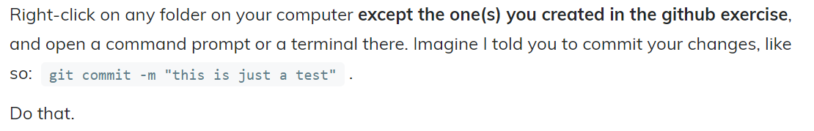

# Reflection One

First off, I think I’m going to learn so much from this course and I’m wildly excited about it. It’s also pretty much entirely new territory for me, so I really appreciated listening to Dr. Graham’s framework around failure. I’m the kind of person who tends to see failure as a personal attack, which is something I’ve been trying to work on not doing for about two years now. While I’m definitely in a much better space than I was when I started, I still have a ways to go. So, having this class – where I’m going to be challenged in an entirely new way – is going to be a really great opportunity for me to learn something I don’t know a lot about and contribute to my personal growth goals! 

This week, we had to set up Zotero, Hypothesis, and Github. I have previously used Zotero for research projects, so I was already familiar with that platform! However, I’d never heard of Hypothesis or Github. Hypothesis looks like a fantastic annotation tool that was super easy to set up, so I might try using it for annotating my other early summer course readings to keep myself in practice with the platform. Overall, getting these two going was super easy. 

Github, however, I think is going to be more of a learning curve. I didn’t have any issues setting up my first repo and ensuring it was initialized with a README (thanks Dr. Graham for the super detailed instructions and screenshots! They were funny, too – I laughed when you said “skip telling Github anything about yourself”). However, once I had everything set up, I somehow managed to delete my README from my repo??? I don’t know how I did it in the first place, and I wasn't able to replicate it (which I tried, to see if I could learn what to avoid). My first thoughts in terms of solving my self-created problem was that I would just go through the steps that Dr. Graham provided for if you hadn’t clicked the “initialize with a README” box in the first place. However, when I took a closer look they proved complex enough to overwhelm my already panicking brain. Instead, I solved my issue by googling how to delete a repo and following those steps. I hadn’t added information to my repo before I deleted the README, so I was able to just delete the whole thing and start over. Looking back on it, I’m a little mad with myself that I didn’t take the chance to learn how to initialize a README the hard way. That being said, at the time I was also dealing with a work issue that had come up, and just didn’t have the bandwidth. I’m sure that by the time I’m done with this course, that kind of thing will feel less overwhelming. 

I was also very confused by this entire paragraph in the [Asking For Help section of our class site:](https://craftingdh.netlify.app/week/1/help/)

Because I didn’t know what a command prompt was. Luckily, I was able to scroll through the #week-one channel and Dr. Graham had answered a similar question from another student. As such, I decided to base my demo help request around it. 

## My Thoughts on the Readings

Prior to starting this course, I only had a vague idea what digital history might encompass. When I was in first year, we had a guest speaker come into a creative writing elective I was taking, and he piqued my interest. I tried taking DIGH classes several times, but they kept conflicting with required classes for my program. I was very excited to finally be able to take a DIGH course, but after four years had honestly forgotten why I wanted to in the first place. My understanding of digital history now – after one week in the course – is that this is a field full of potential. I am very excited about the emphasis on open access content that not only informs, but endeavours to tell stories. While reading through this week’s materials, two questions came to mind: Who has access to digital histories? And, whose voices are heard?

The materials covered this week had a heavy focus on access, and the question of the true meaning of “open access” came up several times. It was defined not only with regard to licensing and transparency, but also in terms of broadening access to education and knowledge. I believe that open access is tremendously valuable, and I also want to question the assertion that our current understanding of open access is truly "free". For example, open-access digital history projects are inherently hosted online – what if this is a space that someone can’t access, based on an inability to afford internet or a device that uses it? This is particularly relevant in Canada, where the corporate telecommunications landscape has driven costs high. While this is not my reality, it’s something that concerns me in terms of what we consider accessible to the public. If someone does not have access, how can they contribute? Will their voice be heard?

All three readings additionally discussed the issue of silencing particular voices. This is often not purposeful, but rather occurs due to the systematic and institutional privileging of certain voices over others. The fact that men, and white men in particular, have been given a dominant position in the history of digital history does not surprise me. Instead, I was inspired to see each piece suggesting concrete actions that could work to uplift some of the groups of people who have traditionally been excluded, both from digital history and from academia in general. I believe that digital history has the ability to tell compelling stories about the rich and varied histories of marginalized communities, largely due to its collaborative potential. Importantly, this work can be driven by members of those communities. One example that was brought up in [Amalia Skarlatou Levi’s Twitter thread](https://twitter.com/amaliasl/status/1245544256212807680) is the [Transgender Archives Project](https://www.digitaltransgenderarchive.net/). I have the pleasure of knowing its founder, Dr. Aaron Devor, so this project is particularly dear to my heart as an example of digital archive work. 

Something that was new to me this week was how the texts had to be considered ‘in conversation.’ Not just in conversation with each other as academic works grappling with similar issues in the same field, but also in conversation with their readers, who – through tools like Hypothesis and CommentPress – are given the opportunity to actively contribute to the project of knowledge creation. While it’s certainly amusing to read through comments that critique not only the text but each other, navigating these threads encouraged me to think more critically about what I was reading, and made me carefully consider my own reactions to each text.  
